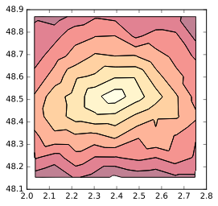
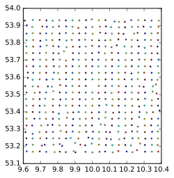

# python-osrm
A Python wrapper around the [OSRM API](https://github.com/Project-OSRM/osrm-backend/wiki/Server-api).
  
[](https://travis-ci.org/mthh/python-osrm)
  
- Provide an easy access to *viaroute*, *table*, *trip*, *match* and *nearest* functionnalities.
- Wrap most of the options of the API (overview, steps, alternatives, etc.).
- Allow to directly decode geometry to various formats (list of coordinates, WKT, WKB) to be integrated in, let's say, a geo-layer creation with python ogr package.
- Send coordinates encoded as Polyline as this is the prefered way to query the API.
- Allow to draw accessibility isochrones around a point (through the utilisation of OSRM *table* service).
- Intended to work on python 2.7.x and python 3.
- Open to suggestions !

## Install
```
git clone git@github.com:ustroetz/python-osrm.git
cd python-osrm
python setup.py install
```

## Running the test suite
```
python setup.py test
```

## Requires
  * polyline
  * numpy
  * pandas
  * geopandas
  * GDAL

## Usage

### match
```python
In [17]: import osrm

In [18]: points = [(-33.45017046193167,-70.65281867980957),
          (-33.45239047269638,-70.65300107002258),
          (-33.453867464504555,-70.65277576446533)]

In [19]: result = osrm.match(points, step=False, overview="simplified")
```

### route
Return the original JSON reponse from OSRM (with optionnaly the geometry decoded in WKT or WKB),
allow optionnaly to only output the routes.
```python
In [23]: import osrm
In [24]: result = osrm.simple_route(
                      [21.0566163803209,42.004088575972], [20.9574645547597, 41.5286973392856],
                      output='route', overview="full", geometry='wkt')

In [25]: result['distance']
Out[25]: 76271

In [26]: result['geometry']
Out[26]:
'LINESTRING (21.056616 42.004088 0,21.056629 42.004078 0,21.056937 42.003885 0,
(...)
,20.957376 41.529222 0,20.957172 41.528817 0,20.957466 41.528699 0)'
```

### table
A simple wrapping function to fetch the matrix computed by OSRM as a dataframe (or as a numpy array),
as well as corrected/snapped localisation of the points used.
```python
In [28]: import osrm

In [29]: list_coord = [[21.0566163803209, 42.004088575972],
    ...:               [21.3856064050746, 42.0094518118189],
    ...:               [20.9574645547597, 41.5286973392856],
    ...:               [21.1477394809847, 41.0691482795275],
    ...:               [21.5506463080973, 41.3532256406286]]

In [30]: list_id = ['name1', 'name2', 'name3', 'name4', 'name5']

In [31]: time_matrix, snapped_coords = osrm.table(list_coord,
                                  				  ids_origin=list_id,
                                  				  output='dataframe')

In [32]: time_matrix
Out[32]:
       name1  name2  name3  name4  name5
name1    0.0   25.7   69.8  169.7  126.8
name2   26.1    0.0   88.1  149.4  106.3
name3   70.2   88.6    0.0  100.0   65.6
name4  158.4  137.6   99.8    0.0   49.4
name5  115.4   94.6   65.6   48.8    0.0
```

### nearest

```python
In [22]: import osrm

In [23]: res = osrm.nearest([22.1021271845936,	41.5078687005805])

In [24]: res
Out[24]:
{'waypoints': [{'name': 'Friedrichstraße',
   'hint': 'niwKgGPotIqSrAAAEAAAABgAAAAGAAAAAAAAAP-KNAepXJkDbrcAAP9LzACoWCEDO0zMAKxYIQMBAAEBfDhq3w==',
   'location': [13.388799, 52.517032],
   'distance': 4.085341}],
 'code': 'Ok'}

```

### Accessibility isochrones (based on OSRM *table* service):
Current options are the number of class and the precision/size of the underlying grid used.
```python
In [1]: import osrm

In [2]: Accessibility = osrm.AccessIsochrone((10.00,53.55), points_grid=450)

In [3]: gdf = Accessibility.render_contour(n_class=8)

In [4]: gdf.plot(cmap="YlOrRd")
Out[4]: <matplotlib.axes._subplots.AxesSubplot at 0x7f13447b8978>
```

```python
In [5]: Accessibility.grid.plot()  # The grid of points is stored as a GeoDataFrame too
Out[5]: <matplotlib.axes._subplots.AxesSubplot at 0x7f134467ae80>
```



### Trip
Fetch the full result (with geometry decoded to list, WKT or WKB) or grab only
the order of the point to travel from.
```python
```

### Using a *Point* instance to avoid confusion between x/y/latitude/longitude :

```python
In [25]: from osrm import Point, simple_route

In [26]: p1 = Point(latitude=2.386459, longitude=48.512369)

In [27]: p2 = Point(latitude=2.536974, longitude=48.793416)

In [28]: result = simple_route(p1, p2)
```

### Easily change the host / profile name to query:
#### By changing the default url :

```python
In [31]: import osrm

In [32]: osrm.RequestConfig
Out[32]: http://localhost:5000/*/v1/driving

In [33]: osrm.RequestConfig.host = "router.project-osrm.org"

In [34]: result = osrm.simple_route(p1, p2)
```

#### Or using a new *RequestConfig* instance, to switch between various url and use basic authentification :

```python
In [35]: MyConfig = osrm.RequestConfig("localhost:9999/v1/biking", basic_auth=("user", "pass"))

In [36]: MyConfig
Out[36]: localhost:9999/*/v1/biking

In [37]: MyConfig.profile = "driving"

In [38]: MyConfig
Out[38]: localhost:9999/*/v1/driving

In [39]: result = osrm.simple_route(p1, p2, url_config=MyConfig)
```

